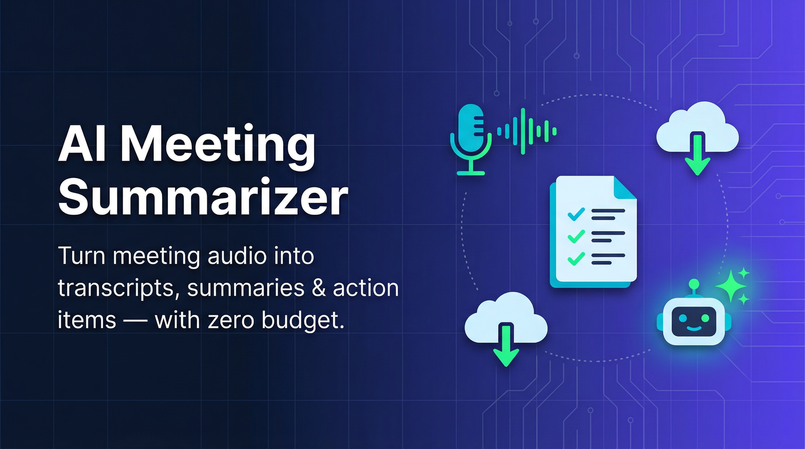
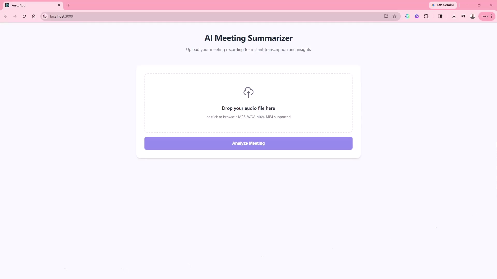
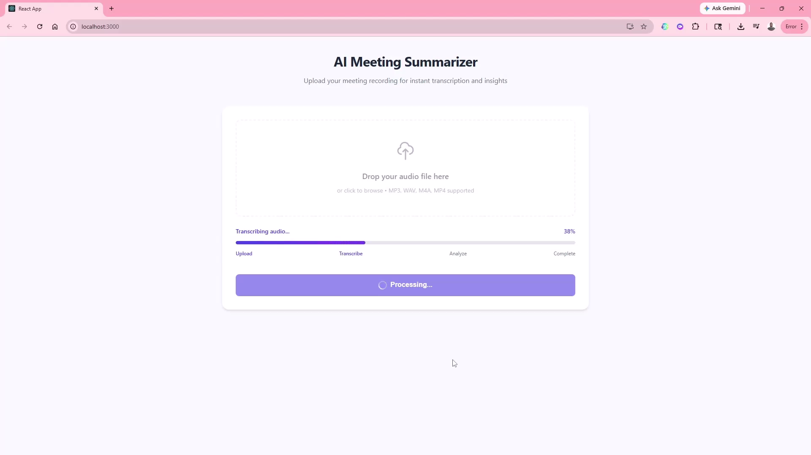
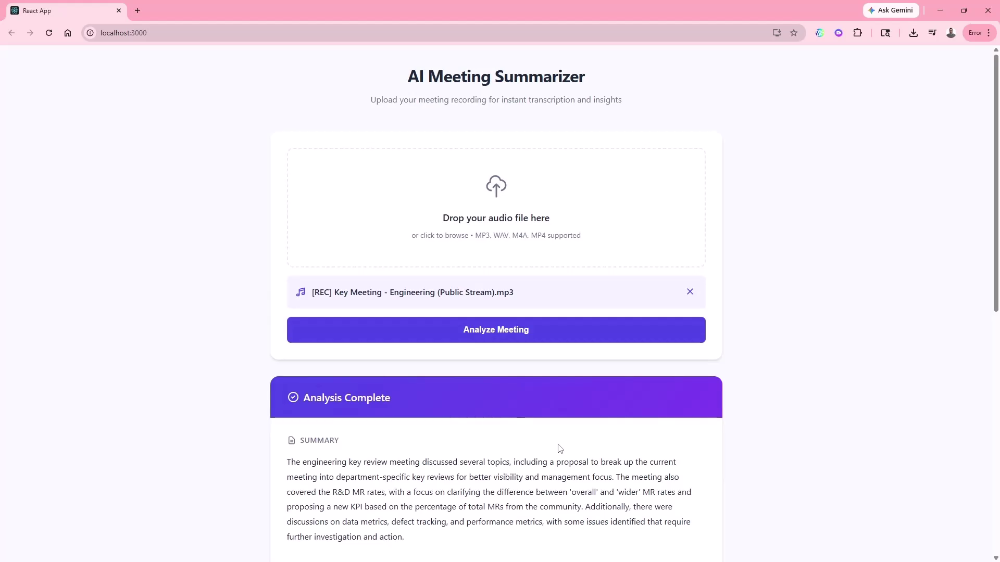
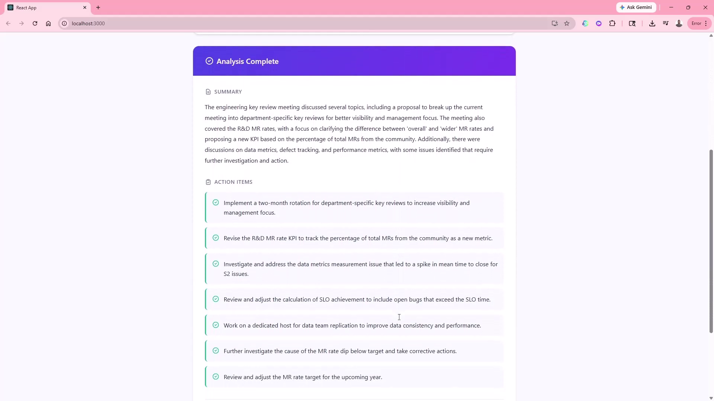
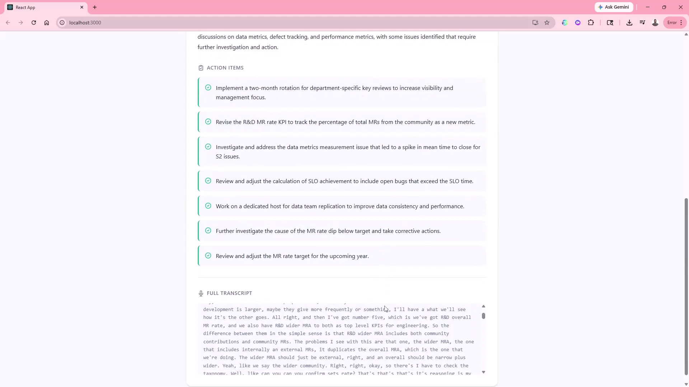

# AI Meeting Summarizer



## Demo Video

<video width="100%" controls>
  <source src="https://github.com/user-attachments/assets/7472ff09-6d16-4469-a2b6-2511c2593f3a" type="video/mp4">
  Your browser does not support the video tag.
</video>

> **Tip**: For GitHub.com, use GitHub LFS to upload, then drag the video into an issue to get an embed URL: `https://github.com/user-attachments/assets/VIDEO_ID`

[](https://www.python.org/)
[](https://fastapi.tiangolo.com/)
[](https://reactjs.org/)
[](https://github.com/openai/whisper)
[](https://open.bigmodel.cn/)
[](https://www.sqlite.org/)
[](https://opensource.org/licenses/MIT)

> Transform meeting recordings into transcripts, summaries, and action items — completely free.

## Table of Contents

- [Banner Image](#banner-image)
- [App Background](#app-background-information)
- [Features](#features)
- [Tech Stack](#tech-stack)
- [Setup Instructions](#setup-instructions)
  - [Prerequisites](#prerequisites)
  - [Backend Setup](#backend-setup)
  - [Frontend Setup](#frontend-setup)
  - [Running the Application](#running-the-application)
- [Screenshots](#screenshots)
- [Future Enhancements](#future-enhancements)
- [Author Details](#author-details)
- [License](#license)
- [Contributing](#contributing)
- [Acknowledgments](#acknowledgments)

---

## App Background Information

### Why This Project Was Built

Building AI-powered applications often requires significant budget for API calls and model hosting. This project was created to demonstrate that **completely free AI tools** can power production-ready applications. With the emergence of open-source models and generous free tiers from AI providers, accessible AI is now a reality for developers on any budget.

### The Problem It Solves

Manual meeting note-taking is time-consuming and often inconsistent. Team members spend valuable time transcribing discussions, identifying key points, and tracking action items — time that could be spent on actual work. This application automates the entire process:

1. Upload your meeting recording (MP3, WAV, M4A, MP4)
2. Get an accurate transcript via OpenAI Whisper
3. Receive an AI-generated summary with extracted action items
4. Review and act on the results immediately

### How It Works

```
┌─────────────┐     ┌──────────────┐     ┌─────────────┐     ┌─────────────┐
│   Upload    │────▶│   Whisper    │────▶│  GLM-4-Flash│────▶│   Dashboard │
│   Audio     │     │ Transcription│     │   Summary   │     │   Display   │
└─────────────┘     └──────────────┘     └─────────────┘     └─────────────┘
```

1. **Upload**: User drags and drops an audio file onto the web interface
2. **Transcription**: FastAPI backend sends audio to OpenAI Whisper (tiny model for CPU efficiency)
3. **Summarization**: The transcript is sent to Zhipu AI's GLM-4-Flash (free tier) for analysis
4. **Display**: Results are shown on the dashboard with summary and action items

### Why Free LLMs Are Now Viable

The AI landscape has changed dramatically:

- **Open-source models**: Whisper, LFM2-2.6B-Transcript offer powerful local transcription
- **Free tiers**: Zhipu AI, Hugging Face, and others provide generous free API access
- **CPU-friendly options**: Smaller models like Whisper "tiny" run efficiently on standard hardware
- **No infrastructure costs**: Serverless APIs mean you only pay for compute you use

---

## Features

- **Drag-and-drop upload** — Simple file upload with visual feedback
- **Real-time progress** — Visual progress bar showing transcription and analysis status
- **Automatic summarization** — AI-powered summary extraction
- **Action item detection** — Identifies actionable tasks from meeting discussions
- **SQLite storage** — Local database for meeting history
- **Responsive design** — Works on desktop and mobile devices
- **Dark mode support** — Modern UI with dark theme capability

---

## Tech Stack

| Component     | Technology             | Purpose               |
| ------------- | ---------------------- | --------------------- |
| Frontend      | React 19               | User interface        |
| Backend       | FastAPI                | REST API server       |
| Database      | SQLite                 | Local data storage    |
| Transcription | OpenAI Whisper         | Audio-to-text         |
| Summarization | GLM-4-Flash (Zhipu AI) | AI summary generation |
| Styling       | CSS3                   | Modern responsive UI  |

---

## Setup Instructions

### Prerequisites

Before you begin, ensure you have the following installed:

- **Python**: Version 3.9 or higher ([download](https://www.python.org/downloads/))
- **Node.js**: Version 18 or higher ([download](https://nodejs.org/))
- **npm**: Comes with Node.js installation

Verify your installations:

```bash
python --version
node --version
npm --version
```

---

### Backend Setup

1. **Clone the repository**

```bash
git clone https://github.com/your-username/meeting-summarizer.git
cd meeting-summarizer
```

2. **Create a virtual environment**

```bash
# Windows (PowerShell)
python -m venv venv
.\venv\Scripts\Activate

# macOS / Linux
python -m venv venv
source venv/bin/activate
```

3. **Install backend dependencies**

```bash
pip install -r requirements.txt
```

4. **Set up environment variables**

Copy the example environment file and add your API key:

```bash
copy .env.example .env
```

Edit `.env` and add your Zhipu AI API key:

```bash
# .env file
ZHIPU_API_KEY=your_free_zhipu_api_key_here
```

> **Note**: Never commit real API keys to version control. The `.env` file is already in `.gitignore`. See `.env.example` for the required format.

5. **Get your Zhipu API key**

Visit [https://open.bigmodel.cn/](https://open.bigmodel.cn/) to:

- Create a free account
- Navigate to API Key management
- Generate a new API key
- Copy it to your `.env` file

6. **Run the backend server**

```bash
python main.py
```

You should see output like:

```
Loading Whisper model (tiny)...
Whisper model loaded!
Uvicorn running on http://0.0.0.0:8000
```

---

### Frontend Setup

1. **Navigate to the frontend directory**

```bash
cd frontend
```

2. **Install frontend dependencies**

```bash
npm install
```

3. **Start the development server**

```bash
npm start
```

The frontend will open at [http://localhost:3000](http://localhost:3000).

---

### Running the Application

You need both servers running simultaneously:

**Terminal 1 (Backend)**:

```bash
cd meeting-summarizer
.\venv\Scripts\Activate
python main.py
```

**Terminal 2 (Frontend)**:

```bash
cd meeting-summarizer/frontend
npm start
```

Access the application at [http://localhost:3000](http://localhost:3000).

---

### Alternative: Using Local LLM

For offline summarization, you can use the local LFM2-2.6B-Transcript model instead of GLM-4-Flash.

1. **Uncomment the local model code** in `main.py` (lines 62-78)

2. **Replace the LLM call** in the `/upload` endpoint to use `summarize_with_llm_local()`

3. **Install additional dependencies**:

```bash
pip install transformers torch
```

> **Note**: The local model requires more RAM and may be slower on CPU-only machines.

---

## Screenshots

<!-- Add screenshots of your application -->



<!-- Instruction: Take a screenshot of the drag-and-drop upload area and save as screenshot-upload.png -->









<!-- Instruction: Take a screenshot showing the summary, action items, and transcript sections -->

---

## Future Enhancements

Here are planned improvements for future versions:

1. **User authentication and meeting history**
   - Add login functionality with JWT tokens
   - Store meeting history per user
   - Search and filter past meetings

2. **Real-time transcription (WebSockets)**
   - Stream transcription progress to frontend
   - Show live transcript as audio is processed
   - Progress updates during transcription

3. **Multiple LLM provider support**
   - Add support for Google Gemini
   - Integrate Ollama for local models
   - Allow users to choose their preferred provider

4. **Export capabilities**
   - Export summaries to PDF
   - Push to Notion pages
   - Send summaries to Slack channels

5. **Speaker diarization**
   - Identify different speakers in the recording
   - Label speaker segments in transcript
   - Generate speaker-specific summaries

6. **Browser-based recording**
   - Record meetings directly from the browser using Web Audio API
   - No need to upload pre-recorded files
   - Real-time recording and transcription

---

## Author Details

|              |                                                                 |
| ------------ | --------------------------------------------------------------- |
| **Name**     | Shrekanth Dhondi                                                |
| **Role**     | Full-stack Developer / AI Enthusiast                            |
| **GitHub**   | [@srikant](https://github.com/srikant)                          |
| **LinkedIn** | [Your LinkedIn Profile](https://linkedin.com/in/srikanthdhondi) |

---

## License

This project is licensed under the **MIT License** — see the [LICENSE](LICENSE) file for details.

```
MIT License

Copyright (c) 2026 AI Meeting Summarizer

Permission is hereby granted, free of charge, to any person obtaining a copy
of this software and associated documentation files (the "Software"), to deal
in the Software without restriction, including without limitation the rights
to use, copy, modify, merge, publish, distribute, sublicense, and/or sell
copies of the Software, and to permit persons to whom the Software is
furnished to do so, subject to the following conditions:

The above copyright notice and this permission notice shall be included in all
copies or substantial portions of the Software.

THE SOFTWARE IS PROVIDED "AS IS", WITHOUT WARRANTY OF ANY KIND, EXPRESS OR
IMPLIED, INCLUDING BUT NOT LIMITED TO THE WARRANTIES OF MERCHANTABILITY,
FITNESS FOR A PARTICULAR PURPOSE AND NONINFRINGEMENT. IN NO EVENT SHALL THE
AUTHORS OR COPYRIGHT HOLDERS BE LIABLE FOR ANY CLAIM, DAMAGES OR OTHER
LIABILITY, WHETHER IN AN ACTION OF CONTRACT, TORT OR OTHERWISE, ARISING FROM,
OUT OF OR IN CONNECTION WITH THE SOFTWARE OR THE USE OR OTHER DEALINGS IN THE
SOFTWARE.
```

---

## Contributing

Contributions are welcome! Here's how you can help:

### Reporting Issues

Found a bug or have a feature request? Please open an issue:

1. Go to the [Issues](https://github.com/your-username/meeting-summarizer/issues) page
2. Click "New Issue"
3. Provide a clear description with steps to reproduce
4. Include relevant screenshots if applicable

### Submitting Pull Requests

1. **Fork the repository**
2. **Create a feature branch**: `git checkout -b feature/my-new-feature`
3. **Make your changes** and commit with descriptive messages
4. **Push to your fork**: `git push origin feature/my-new-feature`
5. **Open a Pull Request** with a clear description

### Code Style

- Follow existing code patterns in the repository
- Use meaningful variable and function names
- Add comments for complex logic
- Ensure code is properly formatted

---

## Acknowledgments

- **Original Concept**: Inspired by the article by _Shittu Olumide_ published in **KDnuggets**, March 2026
- **OpenAI Whisper**: For providing the transcription model
- **Zhipu AI**: For the free GLM-4-Flash API tier
- **FastAPI**: For the excellent Python web framework
- **React Community**: For the modern frontend ecosystem

---

_If you find this project useful, please consider giving it a star on GitHub!_
